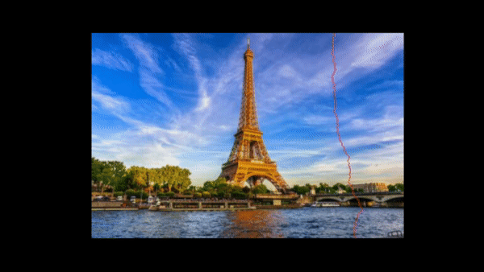
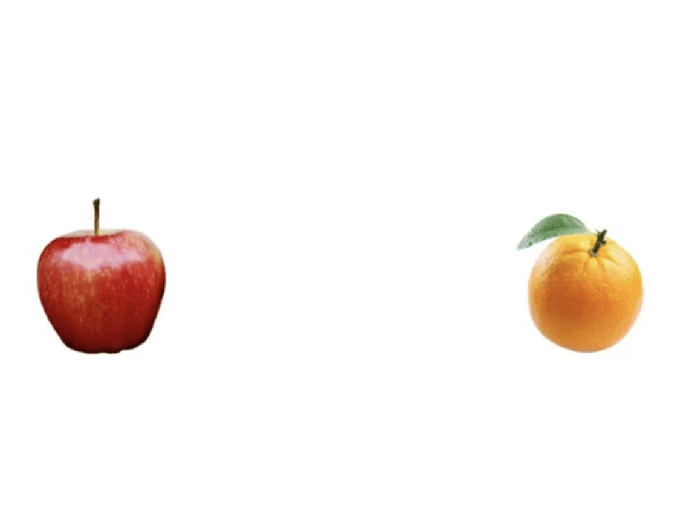
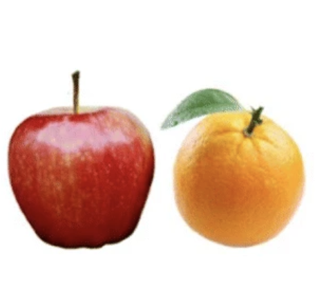

# Seam Carving Implementation

Resizing images using the seam carving algorithm.

## How To Run

Go through the jupyter notebook, `seam_carving.ipynb` to walk through our final project. We use functions in `utils.py`.

The notebook will prompt you to upload an image, and specify the width and height percentages.

## Sample Results

### Eiffel Tower

Original

Transformation

Output

### Apples and Oranges

Original

Output

## Credits

- Eiffel Tower: https://www.kids-world-travel-guide.com/top-10-famous-landmarks.html

- Apples and Oranges: https://link.springer.com/article/10.3758/s13423-021-01949-2

- Opera House: https://traveltriviachallenge.com/world-landmarks-facts/

- Italy: https://globalcastaway.com/biggest-landmarks-in-italy/

- Boat: https://www.vectorstock.com/royalty-free-vector/silhouette-a-man-on-small-boat-vector-30615559

In our report, we tested our outputs against this online seam carving tool: https://trekhleb.dev/js-image-carver/
